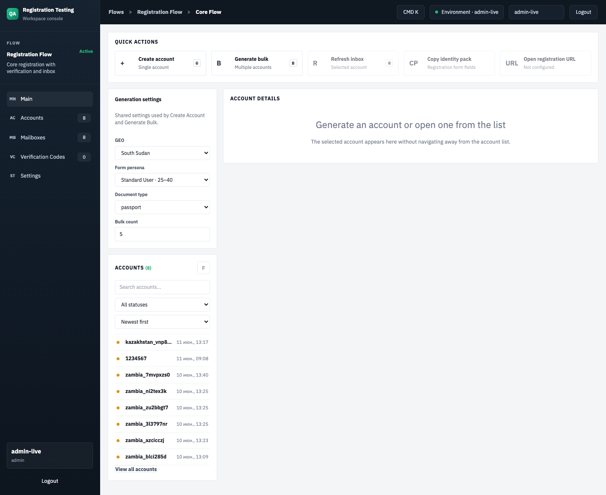
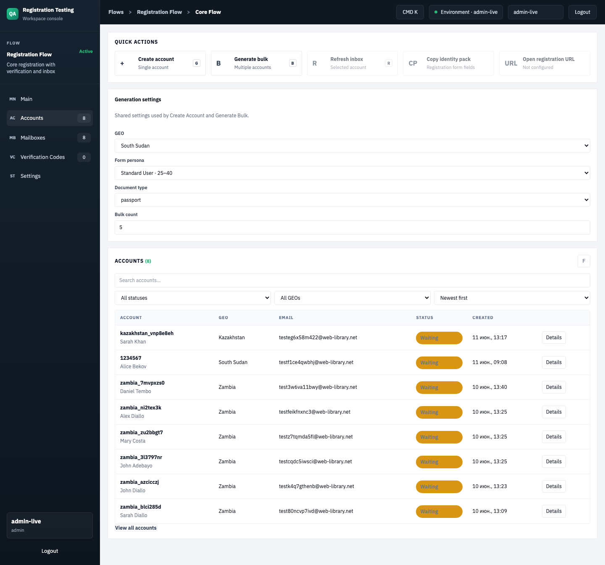
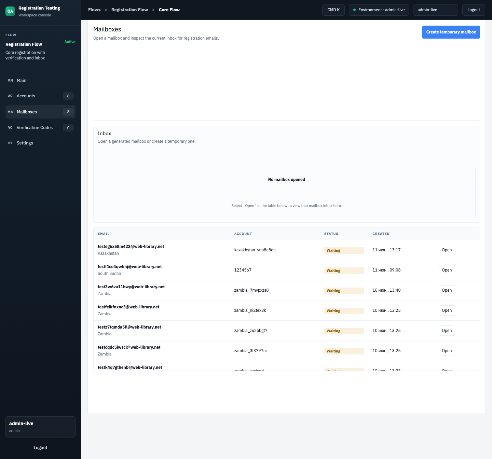
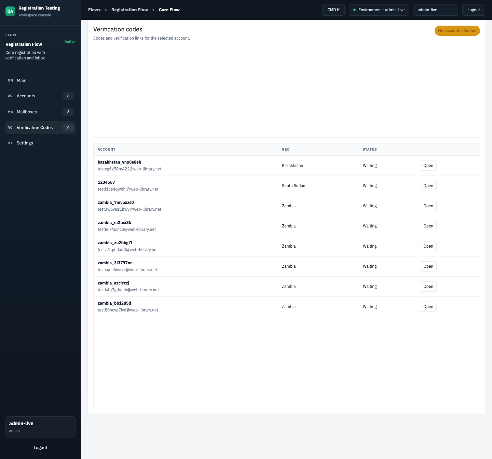
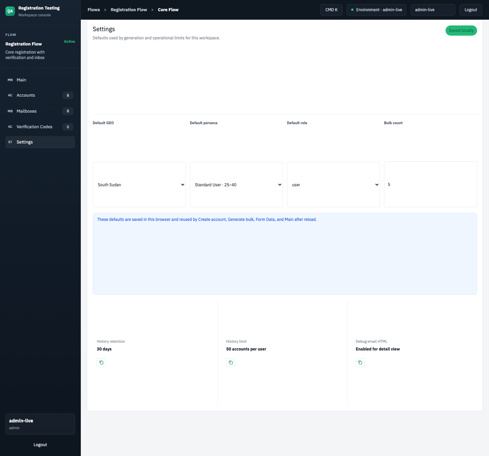
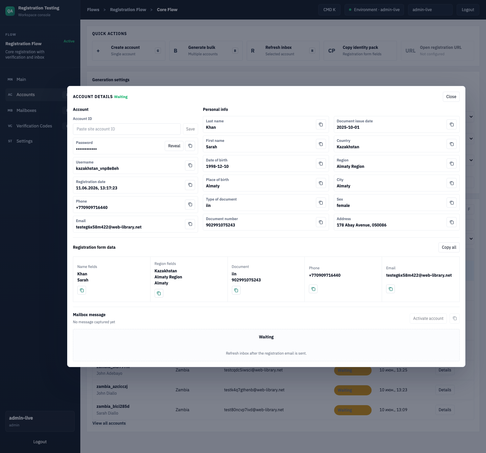
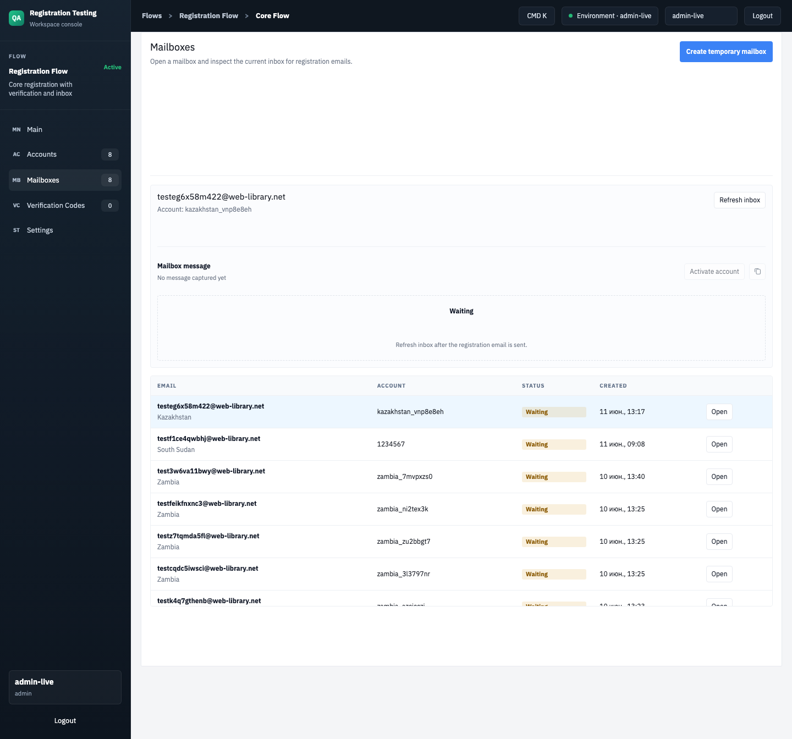

# Test Account Generator V1 - полное описание проекта

Дата актуализации: 2026-06-12  
Production URL: https://test-acc-generator.touchpe.ru  
Текущий продовый коммит на момент описания: `b53eb89 Make mailboxes page inbox focused`

## 1. Назначение проекта

Test Account Generator V1 - внутренняя QA-консоль для быстрого создания тестовых регистрационных аккаунтов под разные GEO.

Проект нужен, чтобы оператор мог:

- сгенерировать реалистичный набор регистрационных данных;
- получить временный email-ящик и пароль к нему;
- получить username, телефон, дату рождения, адрес, регион, город, документ и дату выдачи документа;
- открыть данные аккаунта и быстро копировать поля в форму регистрации;
- проверить inbox выданной почты;
- вытащить verification links и numeric codes из писем;
- хранить последние сгенерированные аккаунты в истории;
- открыть аккаунт из истории и продолжить работу с ним.

Проект не регистрирует аккаунты на целевом сайте сам. Он готовит данные и помогает оператору вручную пройти регистрацию/верификацию.

## 2. Скриншоты веб-части

### Main workspace

Главная рабочая страница: настройки генерации, quick actions, список аккаунтов и detail выбранного аккаунта.



### Accounts

Страница со списком аккаунтов, фильтрами и отдельной модалкой деталей.



### Mailboxes

Страница почтовых ящиков. Здесь нет генераторных quick actions/settings; страница сфокусирована на inbox.



### Verification Codes

Страница кодов и verification links по выбранному аккаунту.



### Settings

Локальные настройки генерации, сохраняемые в браузере.



### Account detail modal

Модалка деталей аккаунта на странице `/accounts`.



### Opened mailbox inbox

Открытый inbox на странице `/mailboxes`.



## 3. Технологический стек

Проект сделан как монорепа с двумя workspace-пакетами.

Backend:

- Node.js;
- TypeScript;
- Express 5;
- SQLite через `better-sqlite3`;
- JWT через `jsonwebtoken`;
- Zod установлен, но основная валидация сейчас ручная;
- mail.tm API как провайдер временной почты;
- `mailparser` для разбора raw email source.

Frontend:

- Next.js 15;
- React 19;
- TypeScript;
- CSS в `frontend/app/globals.css`;
- API-клиент в `frontend/lib/api.ts`;
- основной UI-компонент в `frontend/components/app-shell.tsx`.

Infra:

- Dockerfile с build/runtime стадиями;
- docker-compose;
- nginx reverse proxy;
- SQLite volume `./backend/data:/app/backend/data`.

## 4. Структура проекта

Ключевые файлы:

```text
test-account-generator-v1/
  backend/
    src/
      index.ts                         # Express API и маршруты
      db.ts                            # SQLite schema, seed users, migrations
      services/accountService.ts       # генерация аккаунтов, история, inbox payload
      providers/emailProvider.ts       # интерфейс email-провайдера
      providers/mailTmProvider.ts      # mail.tm integration
      geo-rules.json                   # GEO/document rules
      utils.ts                         # random data, parsing links/codes
      *.test.ts                        # backend tests
  frontend/
    app/
      page.tsx                         # redirect на /main
      main/page.tsx                    # основной workspace
      accounts/page.tsx                # accounts table + detail modal
      mailboxes/page.tsx               # inbox-focused page
      codes/page.tsx                   # verification codes/links
      settings/page.tsx                # local generation defaults
      form-data/page.tsx               # redirect на /main
      globals.css                      # вся стилизация
    components/app-shell.tsx           # основной React app shell
    lib/api.ts                         # apiFetch и типы
    next.config.ts                     # /api rewrite для local dev
  deploy/nginx/
    test-acc-generator.touchpe.ru.conf # nginx config
  docker-compose.yml
  Dockerfile
  README.md
```

## 5. Общая архитектура

Схема runtime:

```text
Browser
  |
  | HTTPS https://test-acc-generator.touchpe.ru
  v
nginx
  |-- /        -> Next.js frontend on 127.0.0.1:3000
  |-- /api/*   -> Express backend on 127.0.0.1:4000

Express backend
  |-- SQLite database: backend/data/app.db
  |-- mail.tm API: domains, accounts, token, messages
```

В браузере frontend всегда обращается к backend через `/api`. На production этот путь проксируется nginx. В local dev Next.js переписывает `/api/*` в `http://127.0.0.1:4000/*`.

## 6. Авторизация

Авторизация простая внутренняя:

1. Пользователь вводит login/password.
2. Frontend вызывает `POST /api/auth/login`.
3. Backend ищет пользователя в таблице `users`.
4. Если пароль совпал, backend выдает JWT на 12 часов.
5. Frontend сохраняет:
   - `tag-token` в `localStorage`;
   - `tag-user` в `localStorage`.
6. Дальше все приватные API-запросы идут с заголовком:

```http
Authorization: Bearer <jwt>
```

Пользователи сидятся из `SEED_USERS_JSON`. В local fallback есть dev-пользователи, но production должен всегда задавать пользователей через env.

Важно: пароли сейчас хранятся в SQLite в открытом виде. Для внутреннего QA-инструмента это допустимо как быстрый V1, но для более жесткой security-модели нужно добавить hashing, например bcrypt/argon2.

## 7. Backend: API

Base path на production: `/api`.

### Health

```http
GET /api/health
```

Ответ:

```json
{ "ok": true }
```

Используется для проверки, что backend жив.

### Login

```http
POST /api/auth/login
Content-Type: application/json

{
  "login": "admin-live",
  "password": "..."
}
```

Ответ:

```json
{
  "token": "...",
  "user": {
    "login": "admin-live",
    "role": "admin"
  }
}
```

### GEO rules

```http
GET /api/geo-rules
Authorization: Bearer <jwt>
```

Возвращает список GEO и доступных типов документов:

```json
{
  "items": [
    {
      "key": "south_sudan",
      "label": "South Sudan",
      "documentTypes": ["national_id", "passport"]
    }
  ]
}
```

### Account history

```http
GET /api/history
Authorization: Bearer <jwt>
```

Возвращает последние аккаунты текущего пользователя. История ограничена 50 аккаунтами на пользователя.

### Account detail

```http
GET /api/history/:id
GET /api/history/:id?debug=1
Authorization: Bearer <jwt>
```

Возвращает полный detail аккаунта:

- email;
- password mailbox;
- username;
- account id;
- ФИО;
- телефон;
- дата рождения;
- GEO поля;
- document fields;
- inbox status;
- links;
- codes;
- raw HTML письма, если передан `debug=1`.

### Generate single account

```http
POST /api/accounts/generate?debug=1
Authorization: Bearer <jwt>
Content-Type: application/json

{
  "geoKey": "south_sudan",
  "documentType": "passport",
  "role": "user",
  "persona": "standard_user"
}
```

Что происходит на backend:

1. Проверяются GEO и document rule.
2. Создается email на mail.tm.
3. Генерируется persona profile.
4. Генерируется document value из шаблона GEO.
5. Создается username.
6. Backend сразу делает initial inbox fetch.
7. Все сохраняется в `account_history`.
8. Возвращается полный detail.

### Generate bulk

```http
POST /api/accounts/generate-bulk
Authorization: Bearer <jwt>
Content-Type: application/json

{
  "geoKey": "south_sudan",
  "documentType": "passport",
  "role": "user",
  "persona": "standard_user",
  "count": 5
}
```

Ограничения:

- minimum: 1;
- maximum: 25.

Backend генерирует аккаунты последовательно, чтобы не бить mail.tm слишком агрессивно.

### Create standalone mailbox

```http
POST /api/mailboxes/create
Authorization: Bearer <jwt>
```

Создает временный mailbox без создания account history row. Используется на `/mailboxes`, когда нужно просто получить почтовый ящик.

### Fetch standalone mailbox inbox

```http
POST /api/mailboxes/inbox
Authorization: Bearer <jwt>
Content-Type: application/json

{
  "address": "test...@domain",
  "password": "...",
  "waitMs": 0
}
```

Проверяет inbox по выданным mailbox credentials.

`waitMs` ограничен backend до 60000 ms.

### Refresh generated account inbox

```http
POST /api/history/:id/refresh-inbox?debug=1
Authorization: Bearer <jwt>
Content-Type: application/json

{
  "waitMs": 0
}
```

Backend берет email/password из history row, идет в mail.tm, обновляет inbox fields в SQLite и возвращает новый detail.

### Update site account id

```http
PATCH /api/history/:id/account-id?debug=1
Authorization: Bearer <jwt>
Content-Type: application/json

{
  "siteAccountId": "123456"
}
```

Сохраняет account id, полученный на целевом сайте после регистрации. Значение trim-ится и ограничивается 80 символами.

### Delete history row

```http
DELETE /api/history/:id
Authorization: Bearer <jwt>
```

Удаляет аккаунт из истории текущего пользователя.

## 8. Backend: база данных

SQLite database: `backend/data/app.db`.

В docker-compose база сохраняется через volume:

```yaml
volumes:
  - ./backend/data:/app/backend/data
```

### Таблица users

Поля:

- `id`;
- `login`;
- `password`;
- `role`: `admin` или `user`;
- `created_at`.

Seed users загружаются из env `SEED_USERS_JSON`. При старте backend делает upsert по `login`, то есть может обновить password/role существующего пользователя.

### Таблица account_history

Основная таблица истории аккаунтов.

В ней хранятся:

- `user_id`;
- `geo_key`, `geo_label`;
- `email`, `email_password`;
- `username`;
- `site_account_id`;
- личные данные: first/last name, phone, age, gender, date of birth;
- GEO данные: country, region, city, place of birth, address, postal code;
- persona;
- account role;
- document type/value/issue date/quality;
- registration url, сейчас пустой;
- inbox status;
- inbox sender/subject/received_at;
- inbox plain text;
- inbox links JSON;
- inbox codes JSON;
- inbox raw HTML;
- `created_at`.

Есть индекс:

```sql
idx_account_history_user_created_at ON account_history(user_id, created_at DESC)
```

Backend также содержит lightweight migrations через `ensureColumn(...)`, чтобы добавлять новые колонки при старте без отдельной migration-системы.

### Retention

История чистится двумя способами:

- записи старше 30 дней удаляются;
- после генерации у пользователя остается максимум 50 последних записей.

## 9. Backend: генерация данных

Основная логика находится в `backend/src/services/accountService.ts` и `backend/src/utils.ts`.

### GEO rules

Файл `backend/src/geo-rules.json` содержит документы по GEO.

Поддерживаемые GEO на момент описания:

- Zambia: `passport`, `national_id`;
- Uganda: `passport`;
- Nigeria: `nin`, `passport`;
- Guinea: `passport`;
- Uzbekistan: `passport`, `pinfl`;
- Kazakhstan: `iin`;
- South Sudan: `national_id`, `passport`;
- Generic International: `passport`.

Если для выбранного document type нет rule, backend возвращает:

- `documentValue = "Missing Rules"`;
- `documentQuality = "missing_rules"`.

Это сделано специально, чтобы QA видел, где правила еще не настроены.

### Persona

Поддерживаемые persona:

- `standard_user` - примерно 25-40;
- `young_user` - примерно 18-24;
- `senior_user` - примерно 55+;
- `male_user`;
- `female_user`.

Gender выбирается из persona или случайно.

### GEO profile

Для каждого GEO в `utils.ts` есть country/region/city/postal/street defaults. Например для South Sudan:

- country: South Sudan;
- regions: Central Equatoria, Western Bahr el Ghazal, Upper Nile;
- cities: Juba, Terekeka, Wau, Malakal;
- street prefixes: Nimule Road, Airport Road и т.д.

Из этого собираются:

- country;
- region;
- city;
- place of birth;
- postal code;
- address line;
- phone prefix.

## 10. Backend: mail.tm integration

Email provider реализован в `backend/src/providers/mailTmProvider.ts`.

Основные операции:

1. `GET /domains?page=1` - получить активный домен.
2. `POST /accounts` - создать mailbox.
3. `POST /token` - получить mailbox token.
4. `GET /messages?page=1` - получить список писем.
5. `GET /messages/:id` - получить письмо полностью.

Домен кешируется на `MAIL_TM_DOMAIN_CACHE_TTL_MS`, по умолчанию 1 час.

Polling inbox:

- `MAIL_TM_INBOX_POLL_ATTEMPTS`;
- `MAIL_TM_INBOX_POLL_DELAY_MS`;
- `waitMs` в API может временно увеличить число попыток.

Parsing email:

- raw email source парсится через `mailparser`;
- plain text чистится через `cleanEmailText`;
- links вытаскиваются из HTML anchors и plain text;
- links дедуплицируются;
- primary verification link выбирается scoring-функцией;
- numeric codes ищутся регуляркой `\b\d{4,8}\b`.

Primary verification scoring повышает score для:

- verify;
- confirmation;
- activate;
- complete registration;
- token/code/otp в URL.

И понижает score для:

- unsubscribe;
- preferences;
- privacy/support/help;
- click/track/redirect hosts.

## 11. Frontend: маршруты

Все основные страницы используют один компонент `AppShell`, но передают разный `view`.

### `/`

Redirect на `/main`.

### `/main`

Основной workspace оператора.

Содержит:

- sidebar navigation;
- topbar;
- quick actions;
- отдельную panel `Generation settings`;
- panel `Accounts`;
- inline `Account details`;
- verification links/codes blocks, если они есть.

Quick actions:

- Create account;
- Generate bulk;
- Refresh inbox;
- Copy identity pack;
- Open registration URL, сейчас disabled/not configured.

### `/accounts`

Страница управления историей аккаунтов.

Содержит:

- отдельную panel `Generation settings`;
- таблицу accounts;
- search;
- status filter;
- GEO filter;
- sort;
- compact status pills;
- кнопку `Details`, которая открывает detail в modal overlay.

Account detail modal показывает:

- account id;
- mailbox password;
- username;
- registration date;
- phone;
- email;
- personal info;
- registration form data;
- mailbox message.

### `/mailboxes`

Страница почтовых ящиков и inbox.

Там специально убраны:

- quick actions генератора;
- generation settings;
- лишние account details блоки.

Страница содержит:

- верхний inbox-reader;
- кнопку `Create temporary mailbox`;
- standalone mailbox credentials;
- `Refresh inbox`;
- таблицу сгенерированных mailbox rows;
- compact status chips;
- кнопку `Open`, которая открывает inbox выбранной почты на этой же странице.

### `/codes`

Страница verification codes и links.

Если аккаунт не выбран, показывает таблицу аккаунтов и кнопку `Open`.

Если аккаунт выбран, показывает:

- codes;
- verification links;
- status выбранного аккаунта.

### `/settings`

Локальные browser settings для генерации.

Содержит:

- default GEO;
- default persona;
- default role;
- bulk count;
- note, что настройки saved locally;
- справочные tiles: history retention, history limit, debug email HTML.

Важно: настройки сохраняются в `localStorage`, а не на backend. Поэтому они привязаны к конкретному браузеру/профилю.

### `/form-data`

Сейчас redirect на `/main`. Ранее была отдельная страница, но ее убрали из navigation.

## 12. Frontend: состояние и localStorage

Frontend хранит в `localStorage`:

- `tag-token` - JWT;
- `tag-user` - текущий user object;
- `tag-workspace-settings` - настройки генерации.

`tag-workspace-settings` включает:

```json
{
  "selectedGeo": "south_sudan",
  "documentType": "passport",
  "bulkCount": 5,
  "persona": "standard_user",
  "accountRole": "user"
}
```

Это объясняет поведение автосохранения:

- настройки сохраняются после изменения;
- после reload в том же браузере они должны восстановиться;
- в другом браузере/профиле/инкогнито они не появятся;
- при очистке localStorage они пропадут;
- logout сейчас делает `localStorage.clear()`, поэтому очищает и токен, и settings.

Если нужно серверное автосохранение настроек между устройствами, потребуется отдельная таблица user settings и API.

## 13. Frontend: API client

Файл `frontend/lib/api.ts` содержит:

- `API_URL`;
- shared types;
- `apiFetch<T>()`.

По умолчанию:

```ts
export const API_URL = process.env.NEXT_PUBLIC_API_URL?.trim() || '/api';
```

`apiFetch`:

- добавляет `Content-Type: application/json`;
- добавляет `Authorization`, если передан token;
- выключает cache через `cache: 'no-store'`;
- парсит JSON error;
- возвращает typed JSON response.

## 14. Production deployment

Production deploy flow:

1. Локально внести изменения.
2. Прогнать:

```bash
npm test
npm run build
git diff --check
```

3. Commit.
4. Push в GitHub:

```bash
git push origin main
```

5. На сервере:

```bash
cd /root/projects/test-account-generator-v1
git pull --ff-only
docker compose up -d --build
```

Проект уже настроен как git checkout на production. Для этого проекта лучше не использовать rsync, чтобы prod всегда соответствовал GitHub history.

## 15. Docker/runtime

`docker-compose.yml`:

```yaml
services:
  app:
    build: .
    restart: unless-stopped
    ports:
      - "127.0.0.1:3000:3000"
      - "127.0.0.1:4000:4000"
    env_file:
      - .env.production
    volumes:
      - ./backend/data:/app/backend/data
```

Контейнер стартует оба процесса:

```bash
node backend/dist/index.js &
node node_modules/next/dist/bin/next start -p 3000 -H 0.0.0.0 frontend
```

То есть backend и frontend живут в одном контейнере, но на разных портах.

## 16. nginx

nginx config:

```nginx
location /api/ {
  proxy_pass http://127.0.0.1:4000/;
}

location / {
  proxy_pass http://127.0.0.1:3000;
}
```

Важная деталь: `/api/` проксируется с обрезанием prefix. Поэтому frontend вызывает `/api/auth/login`, а Express видит `/auth/login`.

## 17. Env variables

Основные env:

```text
JWT_SECRET=...
NEXT_PUBLIC_API_URL=/api
SEED_USERS_JSON=[...]
MAIL_TM_BASE_URL=https://api.mail.tm
MAIL_TM_INBOX_POLL_ATTEMPTS=2
MAIL_TM_INBOX_POLL_DELAY_MS=2500
MAIL_TM_DOMAIN_CACHE_TTL_MS=3600000
```

Production credentials не стоит зашивать в документацию. Источник правды - `.env.production` на сервере/в проекте и env внутри контейнера.

## 18. Основной пользовательский flow

### Генерация одного аккаунта

1. Оператор открывает `/main`.
2. Выбирает GEO, persona, document type.
3. Нажимает `Create account`.
4. Backend создает mailbox на mail.tm.
5. Backend генерирует profile + document.
6. Backend сохраняет history row.
7. Frontend показывает Account details.
8. Оператор копирует поля в целевую registration form.
9. После отправки регистрации оператор ждет email.
10. Нажимает `Refresh inbox`.
11. Если письмо пришло, UI показывает текст, links, codes.
12. Оператор копирует/открывает verification link/code.

### Работа с историей

1. Оператор открывает `/accounts`.
2. Ищет аккаунт по email/username/name/GEO.
3. Нажимает `Details`.
4. Получает modal с полными данными и mailbox message.

### Работа с почтой

1. Оператор открывает `/mailboxes`.
2. Нажимает `Open` у нужной строки.
3. Вверху страницы появляется inbox выбранной почты.
4. Можно нажать `Refresh inbox`.
5. Также можно создать standalone temporary mailbox без account history row.

### Работа с кодами

1. Оператор открывает `/codes`.
2. Выбирает аккаунт.
3. Копирует code или verification link.

## 19. Что сейчас важно знать по ограничениям

1. `registration_url` сейчас пустой, поэтому quick action `Open registration URL` disabled.
2. Settings сохраняются только в браузере через localStorage.
3. Logout очищает весь localStorage, включая settings.
4. Password hashing не реализован.
5. SQLite подходит для V1/internal tool, но при росте нагрузки лучше вынести в Postgres.
6. mail.tm может иметь rate limits/нестабильные домены; backend уже кеширует domain и делает polling, но это внешний dependency.
7. Bulk generation идет последовательно и ограничен 25.
8. History ограничена 50 аккаунтами на пользователя и 30 днями retention.
9. Raw email HTML показывается только при `debug=1` detail requests.

## 20. Проверка качества

Стандартная проверка перед деплоем:

```bash
npm test
npm run build
git diff --check
```

Что покрыто тестами:

- backend account service;
- utils parsing/generation helpers;
- frontend имеет smoke test.

Что стоит усилить дальше:

- e2e-тесты login/generate/open inbox;
- тесты для `/mailboxes/inbox`;
- тесты localStorage settings behavior;
- тесты на responsive layout через Playwright.

## 21. Рекомендованные следующие улучшения

1. Добавить server-side user settings, чтобы автосохранение работало между браузерами.
2. Заменить plain password storage на password hashing.
3. Добавить отдельную migration-систему вместо `ensureColumn`.
4. Добавить audit log действий оператора.
5. Добавить real registration URL configuration, чтобы `Open registration URL` стал рабочим.
6. Добавить Playwright e2e suite и хранить visual smoke сценарии в repo.
7. Добавить admin page для управления users вместо ручного `SEED_USERS_JSON`.
8. Добавить health check mail.tm provider status.

